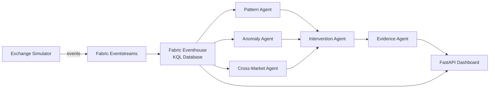

# Market Surveillance Agent System

Real-time market manipulation detection across Asian exchanges (SGX, HKEX, NSE)
using Microsoft Fabric, AI agents, and KQL analytics.



## Features

- **5 AI detection agents** — Pattern, Anomaly, Cross-Market, Intervention, and Evidence Collection
- **Exchange data simulator** with configurable manipulation injection (spoofing, layering, wash trading, price anomalies)
- **KQL real-time detection queries** for spoofing, layering, wash trading, and anomaly detection
- **FastAPI web dashboard** with live simulation, alert inspection, case management, and KQL explorer
- **Automated Azure/Fabric deployment** via Bicep + shell scripts
- **Fabric-native architecture** — Eventhouse for KQL and Eventstreams for ingestion (no standalone ADX or Event Hubs)

## Architecture

The system uses a **Fabric-native** approach that eliminates ~$850/month in redundant services:

| Component | Fabric-Native (this project) | Traditional Approach |
|---|---|---|
| KQL Database | **Fabric Eventhouse** (included in capacity) | Standalone Azure Data Explorer (~$600/mo) |
| Event Ingestion | **Fabric Eventstreams** (included in capacity) | Standalone Event Hubs (~$250/mo) |
| Compute | Container Apps + Fabric capacity | Container Apps + separate clusters |
| Primary Cost | **F8 Fabric capacity (~$1,049/mo)** | ADX + Event Hubs + Fabric (~$1,900/mo) |

All KQL and streaming capabilities run inside the Microsoft Fabric capacity — no standalone
Azure Data Explorer cluster or Event Hubs namespace is required.

## Quick Start

### Prerequisites

- Python 3.10+
- `pip install -r requirements.txt`
- (For full deployment) Azure CLI, an Azure subscription, and a Fabric-enabled tenant

### Local Demo (no Azure needed)

Run the full detection pipeline locally with simulated data — no cloud resources required:

```bash
python run_demo.py
```

This generates simulated exchange events across SGX and HKEX with injected manipulation
(spoofing, layering, wash trading, price anomalies), feeds them through all five agents,
and prints a summary of alerts, intervention cases, and evidence reports.

### Web Dashboard (local)

Start the FastAPI dashboard for interactive exploration:

```bash
uvicorn app.main:app --host 0.0.0.0 --port 8080 --reload
```

Open [http://localhost:8080](http://localhost:8080) to access:

- **Dashboard** — real-time stats overview
- **Simulate** — trigger simulations with configurable parameters
- **Alerts** — browse detected alerts with severity and type
- **Cases** — review intervention cases and evidence reports
- **KQL Explorer** — run KQL queries against Fabric Eventhouse (requires `KQL_URI` env var)

### Full Fabric Deployment

Deploy the entire infrastructure to Azure with a single command:

```bash
./deploy.sh dev
```

This provisions:
1. Fabric F8 capacity with Eventhouse and KQL database
2. Key Vault for secrets management
3. Container App for the dashboard runtime
4. Storage account for outputs and checkpoints
5. Fabric workspace with Eventstreams for ingestion

See [docs/deployment-guide.md](docs/deployment-guide.md) for detailed instructions.

## Project Structure

```
market-surveillance/
├── agents/                         # Detection and response agents
│   ├── pattern_detection_agent.py  # Spoofing & layering detection
│   ├── anomaly_detection_agent.py  # Price/volume anomaly detection
│   ├── cross_market_agent.py       # Cross-exchange correlation
│   ├── intervention_agent.py       # Automated intervention decisions
│   ├── evidence_collection_agent.py# Evidence compilation & reporting
│   └── base_agent.py               # Shared agent base class
├── app/                            # FastAPI web dashboard
│   ├── main.py                     # API routes and HTML pages
│   └── templates.py                # HTML template functions
├── infra/                          # Bicep IaC templates
│   ├── main.bicep                  # Main deployment template
│   ├── modules/
│   │   ├── fabric-capacity.bicep   # Fabric F8 capacity
│   │   └── container-app.bicep     # Container Apps environment
│   └── parameters/
│       └── dev.bicepparam          # Dev environment parameters
├── kql/                            # KQL detection queries
│   ├── spoofing_detection.kql      # Order spoofing patterns
│   ├── layering_detection.kql      # Layering detection
│   ├── wash_trading_detection.kql  # Wash trading detection
│   └── anomaly_detection.kql       # Price/volume anomalies
├── scripts/                        # Deployment helper scripts
│   ├── setup-fabric-workspace.sh   # Fabric workspace + Eventhouse setup
│   ├── init-kql-tables.sh          # KQL table initialization
│   ├── teardown.sh                 # Resource cleanup
│   └── test_fabric_e2e.py          # End-to-end Fabric tests
├── tests/                          # Unit tests
│   ├── test_agents.py              # Agent unit tests
│   └── test_simulator.py           # Simulator unit tests
├── exchange_data_simulator.py      # Exchange data generator
├── run_demo.py                     # Local end-to-end demo
├── deploy.sh                       # One-command Azure deployment
├── Dockerfile                      # Container image for dashboard
└── requirements.txt                # Python dependencies
```

## Detection Agents

### Pattern Detection Agent

Detects structural manipulation patterns in the order book:
- **Spoofing** — large orders placed and rapidly cancelled to move prices
- **Layering** — multiple orders at different price levels to create false depth

Analyzes order placement/cancellation ratios and timing patterns within configurable windows.

### Anomaly Detection Agent

Identifies statistical anomalies in price and volume data:
- Sudden price spikes or drops that deviate from rolling averages
- Volume surges that exceed historical norms
- Uses configurable thresholds and bucket-based history tracking

### Cross-Market Agent

Monitors correlated instruments across multiple exchanges:
- Detects coordinated manipulation across SGX, HKEX, and NSE
- Tracks symbol aliases (e.g., `DBS` on SGX ↔ `0005.HK` on HKEX)
- Computes cross-exchange correlation and flags synchronized anomalies

### Intervention Agent

Makes automated response decisions based on alert severity:
- Evaluates alerts against configurable confidence thresholds
- Generates intervention cases with recommended actions
- Supports dry-run mode for testing without live market impact

### Evidence Collection Agent

Compiles forensic evidence packages for investigation:
- Aggregates raw events surrounding each alert
- Builds case narratives with timeline reconstruction
- Generates structured reports for compliance teams

## Web Dashboard

The FastAPI dashboard provides a browser-based interface for the surveillance system:

| Page | Description |
|---|---|
| `/` | Dashboard overview with event, alert, case, and report counts |
| `/simulate` | Interactive simulation control — select exchanges, duration, and manipulation types |
| `/alerts` | Tabular view of all detected alerts with severity, type, and timestamp |
| `/cases` | Intervention cases with status and linked evidence reports |
| `/reports/{id}` | Detailed evidence report for a specific case |
| `/kql` | KQL query explorer for direct Eventhouse queries |

## Deployment

### Azure Resources (deployed via Bicep)

| Resource | Purpose |
|---|---|
| Microsoft Fabric Capacity (F8) | Eventhouse (KQL), Eventstreams, notebooks |
| Key Vault | Secrets for KQL URI, storage connection strings |
| Container Apps Environment | Hosts the FastAPI dashboard |
| Storage Account | Surveillance output and checkpoint data |
| Log Analytics Workspace | Centralized monitoring and diagnostics |

### Fabric Artifacts (created via REST API)

| Artifact | Purpose |
|---|---|
| Fabric Workspace | Container for all Fabric items |
| Eventhouse + KQL Database (`surveillance`) | Real-time KQL queries against streaming data |
| Eventstreams | Ingestion pipeline from simulator to Eventhouse |

The deployment is orchestrated by `deploy.sh`, which runs the Bicep deployment and then
calls `scripts/setup-fabric-workspace.sh` to create the Fabric artifacts via the
Fabric REST API. See [docs/deployment-guide.md](docs/deployment-guide.md) for full details.

## KQL Detection Queries

The `kql/` directory contains production-ready detection queries for the Fabric Eventhouse:

**Spoofing Detection** (`kql/spoofing_detection.kql`):
```kql
// Detect orders placed and cancelled within a short window
ORDER_BOOK_EVENTS
| where EventType in ("NEW_ORDER", "CANCEL")
| summarize NewCount=countif(EventType == "NEW_ORDER"),
            CancelCount=countif(EventType == "CANCEL")
        by Symbol, bin(Timestamp, 5s)
| where CancelCount > NewCount * 0.8 and NewCount > 5
```

**Wash Trading Detection** (`kql/wash_trading_detection.kql`):
```kql
// Detect same-entity trades on both sides
TRADES
| where BuyBroker == SellBroker
| summarize WashCount=count(), TotalVolume=sum(Volume)
        by Symbol, BuyBroker, bin(Timestamp, 1m)
| where WashCount > 3
```

See the full queries in the `kql/` directory for layering detection and anomaly detection.

## API Reference

All endpoints are served by the FastAPI application at `app/main.py`.

### HTML Pages

| Method | Path | Description |
|---|---|---|
| `GET` | `/` | Dashboard overview |
| `GET` | `/simulate` | Simulation control page |
| `GET` | `/alerts` | Alerts table |
| `GET` | `/cases` | Cases table |
| `GET` | `/reports/{case_id}` | Evidence report |
| `GET` | `/kql` | KQL query explorer |

### JSON API

| Method | Path | Description |
|---|---|---|
| `POST` | `/api/simulate` | Run a simulation (accepts JSON body with config) |
| `GET` | `/api/alerts` | List all alerts |
| `GET` | `/api/cases` | List all intervention cases |
| `GET` | `/api/reports/{case_id}` | Get evidence report for a case |
| `GET` | `/api/stats` | Current system statistics |
| `POST` | `/api/kql` | Execute a KQL query against Fabric Eventhouse |
| `GET` | `/healthz` | Health check |
| `GET` | `/ready` | Readiness check (includes KQL connection status) |

### POST `/api/simulate` — Request Body

```json
{
  "exchanges": ["SGX", "HKEX"],
  "duration": 120,
  "inject_spoofing": true,
  "inject_layering": true,
  "inject_wash_trading": true,
  "inject_price_anomaly": false
}
```

### POST `/api/kql` — Request Body

```json
{
  "query": "TRADES | take 10"
}
```

Requires `KQL_URI` environment variable to be set. Returns `501` if KQL is not configured.

## Testing

Run the unit test suite:

```bash
python -m pytest tests/ -v
```

Tests cover:
- Agent initialization and event processing
- Alert generation and severity classification
- Simulator event generation and manipulation injection
- Edge cases and configuration validation

For end-to-end Fabric integration tests (requires deployed infrastructure):

```bash
python scripts/test_fabric_e2e.py
```

## Environment Variables

| Variable | Required | Description |
|---|---|---|
| `KQL_URI` | No | Fabric Eventhouse KQL endpoint URI. Enables the KQL explorer in the dashboard. |

## License

See [LICENSE](LICENSE) for details.

---

> **Note:** The original 55KB architectural whitepaper is preserved at
> [docs/architecture-whitepaper.md](docs/architecture-whitepaper.md) for reference.
