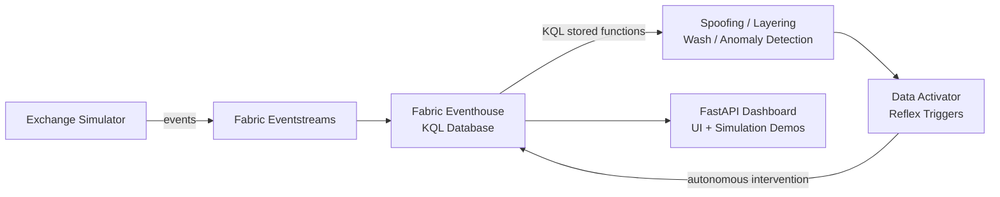

# Market Surveillance Agent System

Real-time market manipulation detection across Asian exchanges (SGX, HKEX, NSE)
using Microsoft Fabric, AI agents, and KQL analytics.



## Features

- **Fabric-native detection** — KQL stored functions for spoofing, layering, wash trading, and anomaly detection run directly in Eventhouse
- **Data Activator triggers** — Reflex triggers for autonomous intervention (no worker containers needed)
- **Ontology graph** in Eventhouse for UBO (Ultimate Beneficial Owner) resolution
- **Exchange data simulator** with configurable manipulation injection (spoofing, layering, wash trading, price anomalies)
- **Python agent library** retained for local testing and simulation demos
- **FastAPI web dashboard** — sole Container App for UI, simulation demos, alert inspection, and KQL explorer
- **Automated Azure/Fabric deployment** via `azd up` (Bicep + postprovision hooks)

## Architecture

Detection runs **natively in Fabric RTI** — no worker containers are needed:

| Component | Purpose |
|---|---|
| **Fabric Eventhouse** | KQL database with stored functions for all detection logic |
| **KQL Stored Functions** | Spoofing, layering, wash trading, and anomaly detection |
| **Data Activator** | Reflex triggers for autonomous intervention |
| **Fabric Eventstreams** | Event ingestion from exchanges / simulator |
| **Dashboard Container App** | Sole Container App — UI and simulation demos |

The system uses a **Fabric-native** approach that eliminates worker containers and ~$850/month in redundant services:

| Component | Fabric-Native (this project) | Traditional Approach |
|---|---|---|
| Detection Logic | **KQL stored functions + Data Activator** (in Fabric capacity) | Worker containers polling Eventhouse |
| KQL Database | **Fabric Eventhouse** (included in capacity) | Standalone Azure Data Explorer (~$600/mo) |
| Event Ingestion | **Fabric Eventstreams** (included in capacity) | Standalone Event Hubs (~$250/mo) |
| Compute | **Single Container App** (dashboard only) | Multiple Container Apps (workers + dashboard) |
| Primary Cost | **F8 Fabric capacity (~$1,049/mo)** | ADX + Event Hubs + Fabric (~$1,900/mo) |

All detection, streaming, and analytics run inside the Microsoft Fabric capacity.
The dashboard Container App provides the UI and simulation demo endpoints.

### Fabric RTI Native Features

The solution leverages Fabric RTI preview features for enhanced detection:

- **[Anomaly Detection Models](docs/fabric-rti-features.md#1-anomaly-detection-models)** — 
  12 built-in ML models (Signal Watcher, Change Spike Detector, etc.) for
  sophisticated price/volume anomaly detection beyond basic Z-scores
- **[Operations Agent](docs/fabric-rti-features.md#2-operations-agent-advisory-layer)** — 
  AI-powered advisory agent that monitors data, provides contextual analysis,
  and recommends actions via Teams (secondary to deterministic Data Activator alerts)

See [Fabric RTI Features Guide](docs/fabric-rti-features.md) for setup instructions.

## Quick Start

### Prerequisites

- Python 3.10+
- `pip install -r requirements.txt`
- (For full deployment) Azure CLI, an Azure subscription, and a Fabric-enabled tenant

### Local Demo (no Azure needed)

Run the full detection pipeline locally with simulated data — no cloud resources required:

```bash
python run_demo.py
```

This generates simulated exchange events across SGX and HKEX with injected manipulation
(spoofing, layering, wash trading, price anomalies), feeds them through all five agents,
and prints a summary of alerts, intervention cases, and evidence reports.

### Web Dashboard (local)

Start the FastAPI dashboard for interactive exploration:

```bash
uvicorn app.main:app --host 0.0.0.0 --port 8080 --reload
```

Open [http://localhost:8080](http://localhost:8080) to access:

- **Dashboard** — real-time stats overview
- **Simulate** — trigger simulations with configurable parameters
- **Alerts** — browse detected alerts with severity and type
- **Cases** — review intervention cases and evidence reports
- **KQL Explorer** — run KQL queries against Fabric Eventhouse (requires `KQL_URI` env var)

See [docs/dashboard-guide.md](docs/dashboard-guide.md) for a complete user guide covering
every page, alert types, severity levels, case lifecycle, and troubleshooting.

### Full Fabric Deployment

Deploy the entire infrastructure to Azure with a single command:

```bash
azd up
```

This provisions:
1. Fabric F8 capacity with Eventhouse and KQL database
2. Key Vault for secrets management
3. Container App for the dashboard (sole Container App — no workers)
4. Storage account for outputs and checkpoints
5. Fabric workspace with detection stored functions and ontology tables

See [docs/deployment-guide.md](docs/deployment-guide.md) for detailed instructions
and [docs/getting-started.md](docs/getting-started.md) for post-deployment verification.

### Scaling Beyond Demo

For guidance on scaling from the demo (12 symbols) to production (1,000+ symbols),
including Fabric capacity tiers (F8/F16/F32) and cost estimates, see
[docs/scaling-guide.md](docs/scaling-guide.md).

## Project Structure

```
market-surveillance/
├── src/
│   ├── agents/                         # Detection and response agents (used by dashboard for demos)
│   │   ├── pattern_detection_agent.py  # Spoofing & layering detection
│   │   ├── anomaly_detection_agent.py  # Price/volume anomaly detection
│   │   ├── cross_market_agent.py       # Cross-exchange correlation
│   │   ├── intervention_agent.py       # Automated intervention decisions
│   │   ├── evidence_collection_agent.py# Evidence compilation & reporting
│   │   └── base_agent.py               # Shared agent base class
│   ├── dashboard/                      # FastAPI web dashboard (sole Container App)
│   │   ├── main.py                     # API routes and HTML pages
│   │   └── templates.py                # HTML template functions
│   ├── simulator/                      # Exchange data simulator
│   └── shared/                         # Shared utilities
├── infra/                              # Bicep IaC templates (used by azd)
│   ├── main.bicep                      # Main deployment template
│   └── modules/
│       ├── fabric-capacity.bicep       # Fabric F8 capacity
│       └── container-app.bicep         # Container Apps environment (dashboard only)
├── kql/                                # KQL detection queries (deployed as stored functions)
│   ├── spoofing_detection.kql          # Order spoofing patterns
│   ├── layering_detection.kql          # Layering detection
│   ├── wash_trading_detection.kql      # Wash trading detection
│   └── anomaly_detection.kql           # Price/volume anomalies
├── scripts/                            # Deployment helper scripts
│   ├── setup-fabric-workspace.sh       # Fabric workspace + Eventhouse setup
│   ├── deploy-stored-functions.sh      # KQL stored function deployment
│   ├── setup-ontology.sh               # Ontology graph setup
│   ├── postprovision.sh                # azd postprovision hook
│   ├── init-kql-tables.sh              # KQL table initialization
│   ├── teardown.sh                     # Resource cleanup
│   └── test_fabric_e2e.py              # End-to-end Fabric tests
├── ontology/                           # Ontology RDF definitions
├── data_activator/                     # Data Activator trigger configs
├── tests/                              # Unit tests
│   ├── test_agents.py                  # Agent unit tests
│   └── test_simulator.py               # Simulator unit tests
├── docs/                               # Documentation
│   ├── getting-started.md              # Post-deployment verification guide
│   ├── deployment-guide.md             # azd deployment instructions
│   ├── scaling-guide.md                # Fabric capacity scaling
│   ├── dashboard-guide.md              # Dashboard user guide
│   └── architecture-whitepaper.md      # Original design whitepaper
├── azure.yaml                          # azd project definition
├── run_demo.py                         # Local end-to-end demo
├── Dockerfile                          # Container image for dashboard
└── requirements.txt                    # Python dependencies
```

## Detection Agents

### Pattern Detection Agent

Detects structural manipulation patterns in the order book:
- **Spoofing** — large orders placed and rapidly cancelled to move prices
- **Layering** — multiple orders at different price levels to create false depth

Analyzes order placement/cancellation ratios and timing patterns within configurable windows.

### Anomaly Detection Agent

Identifies statistical anomalies in price and volume data:
- Sudden price spikes or drops that deviate from rolling averages
- Volume surges that exceed historical norms
- Uses configurable thresholds and bucket-based history tracking

### Cross-Market Agent

Monitors correlated instruments across multiple exchanges:
- Detects coordinated manipulation across SGX, HKEX, and NSE
- Tracks symbol aliases (e.g., `DBS` on SGX ↔ `0005.HK` on HKEX)
- Computes cross-exchange correlation and flags synchronized anomalies

### Intervention Agent

Makes automated response decisions based on alert severity:
- Evaluates alerts against configurable confidence thresholds
- Generates intervention cases with recommended actions
- Supports dry-run mode for testing without live market impact

### Evidence Collection Agent

Compiles forensic evidence packages for investigation:
- Aggregates raw events surrounding each alert
- Builds case narratives with timeline reconstruction
- Generates structured reports for compliance teams

## Web Dashboard

The FastAPI dashboard provides a browser-based interface for the surveillance system:

| Page | Description |
|---|---|
| `/` | Dashboard overview with event, alert, case, and report counts |
| `/simulate` | Interactive simulation control — select exchanges, duration, and manipulation types |
| `/alerts` | Tabular view of all detected alerts with severity, type, and timestamp |
| `/cases` | Intervention cases with status and linked evidence reports |
| `/reports/{id}` | Detailed evidence report for a specific case |
| `/kql` | KQL query explorer for direct Eventhouse queries |

## Deployment

### Azure Resources (deployed via Bicep)

| Resource | Purpose |
|---|---|
| Microsoft Fabric Capacity (F8) | Eventhouse (KQL), Eventstreams, Data Activator, notebooks |
| Key Vault | Secrets for KQL URI, storage connection strings |
| Container Apps Environment | Hosts the FastAPI dashboard (sole Container App) |
| Storage Account | Surveillance output and checkpoint data |
| Log Analytics Workspace | Centralized monitoring and diagnostics |

### Fabric Artifacts (created via REST API)

| Artifact | Purpose |
|---|---|
| Fabric Workspace | Container for all Fabric items |
| Eventhouse + KQL Database (`surveillance`) | Real-time KQL queries against streaming data |
| Eventstreams | Ingestion pipeline from simulator to Eventhouse |

The deployment is orchestrated by `azd up`, which runs the Bicep deployment and then
executes `scripts/postprovision.sh` to create the Fabric artifacts via the
Fabric REST API. See [docs/deployment-guide.md](docs/deployment-guide.md) for full details.

## KQL Detection Queries

The `kql/` directory contains production-ready detection queries for the Fabric Eventhouse:

**Spoofing Detection** (`kql/spoofing_detection.kql`):
```kql
// Detect orders placed and cancelled within a short window
ORDER_BOOK_EVENTS
| where EventType in ("NEW_ORDER", "CANCEL")
| summarize NewCount=countif(EventType == "NEW_ORDER"),
            CancelCount=countif(EventType == "CANCEL")
        by Symbol, bin(Timestamp, 5s)
| where CancelCount > NewCount * 0.8 and NewCount > 5
```

**Wash Trading Detection** (`kql/wash_trading_detection.kql`):
```kql
// Detect same-entity trades on both sides
TRADES
| where BuyBroker == SellBroker
| summarize WashCount=count(), TotalVolume=sum(Volume)
        by Symbol, BuyBroker, bin(Timestamp, 1m)
| where WashCount > 3
```

See the full queries in the `kql/` directory for layering detection and anomaly detection.

## API Reference

All endpoints are served by the FastAPI application at `app/main.py`.

### HTML Pages

| Method | Path | Description |
|---|---|---|
| `GET` | `/` | Dashboard overview |
| `GET` | `/simulate` | Simulation control page |
| `GET` | `/alerts` | Alerts table |
| `GET` | `/cases` | Cases table |
| `GET` | `/reports/{case_id}` | Evidence report |
| `GET` | `/kql` | KQL query explorer |

### JSON API

| Method | Path | Description |
|---|---|---|
| `POST` | `/api/simulate` | Run a simulation (accepts JSON body with config) |
| `GET` | `/api/alerts` | List all alerts |
| `GET` | `/api/cases` | List all intervention cases |
| `GET` | `/api/reports/{case_id}` | Get evidence report for a case |
| `GET` | `/api/stats` | Current system statistics |
| `POST` | `/api/kql` | Execute a KQL query against Fabric Eventhouse |
| `GET` | `/healthz` | Health check |
| `GET` | `/ready` | Readiness check (includes KQL connection status) |

### POST `/api/simulate` — Request Body

```json
{
  "exchanges": ["SGX", "HKEX"],
  "duration": 120,
  "inject_spoofing": true,
  "inject_layering": true,
  "inject_wash_trading": true,
  "inject_price_anomaly": false
}
```

### POST `/api/kql` — Request Body

```json
{
  "query": "TRADES | take 10"
}
```

Requires `KQL_URI` environment variable to be set. Returns `501` if KQL is not configured.

## Testing

Run the unit test suite:

```bash
python -m pytest tests/ -v
```

Tests cover:
- Agent initialization and event processing
- Alert generation and severity classification
- Simulator event generation and manipulation injection
- Edge cases and configuration validation

For end-to-end Fabric integration tests (requires deployed infrastructure):

```bash
python scripts/test_fabric_e2e.py
```

## Environment Variables

| Variable | Required | Description |
|---|---|---|
| `KQL_URI` | No | Fabric Eventhouse KQL endpoint URI. Enables the KQL explorer in the dashboard. |

## License

See [LICENSE](LICENSE) for details.

---

> **Note:** The original 55KB architectural whitepaper is preserved at
> [docs/architecture-whitepaper.md](docs/architecture-whitepaper.md) for reference.
